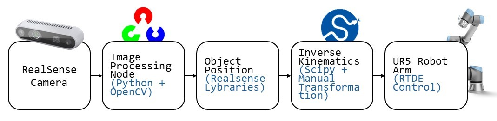

# 🤖 UR5 Collaborative Robot - Pick and Place System

A collaborative robot system using the UR5 arm for automated pick-and-place tasks. It uses computer vision to simulate a smart production line.

---

## 📌 Table of Contents

- [📝 Project Description](#-project-description)
- [✨ Features](#-features)
- [🧠 System Architecture](#-system-architecture)
- [🛠️ Technologies Used](#-technologies-used)
- [⚙️ Installation](#-installation)
- [🎥 Demo](#-demo)
- [📈 Project Status](#-project-status)
- [🙌 Credits](#-credits)

---

## 📝 Project Description

This project involves programming a **UR5 collaborative robot** to perform **pick-and-place operations** based on **visual detection of objects**. 

---

## ✨ Features

- UR5 robotic arm control via specific Universal Robot libraries (rtde_receive, rtde_control and dashboard_client).
- Object detection using OpenCV and pyrealsense2 to control Intel RealSense D435i camera.
- Automated pick-and-place

---

## 🧠 System Architecture

This is the architecture used :

## 🛠️ Technologies Used

### libraries

| **Library**                | **Usage**                                                    |
|----------------------------|--------------------------------------------------------------|
| `cv2`                      | **OpenCV** library for **image processing** and computer vision. |
| `numpy`                    | Library for **matrix manipulation** and **linear algebra**.  |
| `pyrealsense2 as rs`       | Controls and captures data from **Intel RealSense cameras**. |
| `rtde_receive`             | Receives **real-time data** from a UR robot (Universal Robot). |
| `rtde_control`             | Controls **movement and commands** of the UR robot.          |
| `dashboard_client`         | Interacts with the **UR robot control interface** (power on, load programs, etc.). |
| `math`                     | Provides basic **mathematical functions**, like trigonometry and algebra. |
| `time`                     | Controls **time-related functions** (e.g., delays, execution time measurement). |
| `scipy.spatial.transform`  | Performs **3D geometric transformations**, such as rotations. |
| `random`                   | It's used to select **randomly** the cube taked.                   |

### Hardware

- Robot : [UR5](https://www.universal-robots.com/fr/produits/robot-ur5/)
- Camera : [Intel® RealSense™ Depth Camera D435i](https://www.intel.com/content/www/us/en/products/sku/190004/intel-realsense-depth-camera-d435i/specifications.html)

## ⚙️ Installation

The pyrealsense2 could have a special installation 
### Pre-installation Instructions (pyrealsense2)

Before installing `pyrealsense2`, you need to install the **Intel RealSense SDK**. 

- Go to the [Intel RealSense SDK 2.0 Downloads page](https://www.intelrealsense.com/sdk-2/) and download the installer for **Windows**.
- Follow the installation instructions to set up the drivers and SDK.

Once the SDK is installed, you can install the `pyrealsense2` and the rest of lybraries using **pip**.

### Installation command
Open your command prompt (CMD) and run the following command:

`pip install ur-rtde opencv-python numpy pyrealsense2 rtde_receive rtde_control ur-dashboard-client scipy`

## 🎥 Demo

## 📌 TODO / Improvements
- The code currently detects green, yellow, and blue cubes successfully, but it doesn’t work well with red cubes — the mask for red needs improvement.
- We’ve tested different methods to open and close the gripper. At the moment, the trajectory code simply marks when the gripper should open or close, but doesn't control it directly.
- The camera-to-gripper calibration is currently a fixed constant. This could be improved by using the camera for more precise, dynamic calibration.

## 🙋‍♂️ Credits / Authors

This project was developed by :

- **[BRUNEAU Geoffroy]** – Robotics Developer and Vision System Integration  
- **[URBINA German]** – Robotics Developer and Vision System Integration  

It's the final project for the Robotique et Vision class in IMT - Nord Europe.

## Links used

https://github.com/nickredsox/youtube.git

https://github.com/IntelRealSense/librealsense/tree/master/wrappers/python#installation

https://github.com/insmins/projetP1

https://github.com/ceri-num/uv-robvis/blob/master/TP1-UR5.md

